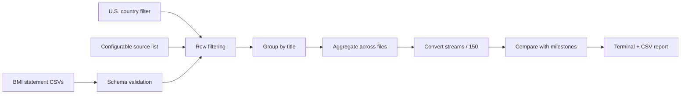
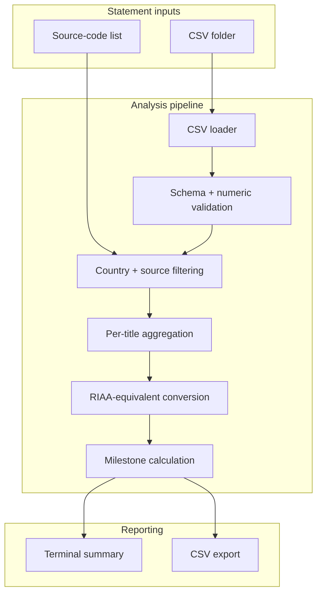

# BMI Statement / RIAA Progress Estimator

> A small music-data tool I built to aggregate selected U.S. performance rows from BMI statement exports and estimate how much RIAA Digital Single streaming-equivalent progress a song may represent.


> [!IMPORTANT]
> This is a **heuristic analytics tool**, not an official RIAA certification checker. BMI royalty statements are not the same thing as the label-side data package used for RIAA certification, and the output should be interpreted only as an estimate from the supplied statement rows.

This project is independent and is not affiliated with, endorsed by, or operated by BMI or the RIAA.

## Why I built this

As a producer / songwriter, royalty statements contain a lot of useful information but are not always convenient for answering simple catalogue questions.

I wanted a quick way to ask:

> Across the BMI statement CSVs I have, how much selected U.S. on-demand streaming activity is associated with each title — and what does that roughly look like when expressed in RIAA Digital Single streaming-equivalent units?

The original version was a short pandas script. This repository turns that idea into a more explicit and reusable data pipeline with:

- statement schema validation;
- configurable source-code filtering;
- multi-file aggregation;
- RIAA streaming-equivalent conversion;
- milestone/progress reporting;
- synthetic example data;
- tests and a small CLI.

---

# Example

The repository includes two **synthetic** BMI-style statement files under [`examples/statements/`](examples/statements/).

Running:

```bash
riaa-progress examples/statements \
  --sources config/riaa_sources.txt \
  --output output/example_summary.csv
```

produces:

```text
TITLE                          OBSERVED STREAMS   EST. UNITS             NEXT   PROGRESS
----------------------------------------------------------------------------------------
MY BODY                              75,138,749      500,924         Platinum     50.09%
SWAG ON POINT                        13,501,430       90,009             Gold     18.00%

Processed 2 CSV file(s). Saved report to output/example_summary.csv

Important: this is a heuristic progress estimate from the supplied BMI statement
data, not an official RIAA certification result.
```

For the first example title:

```text
Observed selected U.S. performance count:      75,138,749
÷ 150 streams per Digital Single unit:         500,924 estimated units

Gold threshold:                                500,000 units
Estimated progress:                            100.18 %
Estimated units remaining for RIAA Gold:       0

Platinum threshold:                            1,000,000 units
Estimated progress:                            50.09%
Estimated units remaining for RIAA Platinum:   499,076

```

That result does **not** mean the title is officially RIAA gold certified. It means the rows included by this tool correspond to that many streaming-equivalent units under the conversion formula.

---

# What it does



The estimator:

1. discovers all CSV files in a statement folder;
2. verifies the required BMI-style columns;
3. keeps `COUNTRY OF PERFORMANCE == UNITED STATES`;
4. keeps only configured `PERF SOURCE` values;
5. sums `PERF COUNT` by `TITLE NAME`;
6. aggregates the same title across all supplied statement files;
7. divides the observed count by `150` to calculate estimated streaming-equivalent Digital Single units;
8. compares the result with the next RIAA unit milestone;
9. exports the final table to CSV.

---

# RIAA criteria used by the estimator

The current RIAA Digital Single criteria state that:

- **150 on-demand audio and/or video streams = 1 download sale / unit equivalent**
- **Gold = 500,000 units**
- **Platinum = 1,000,000 units**
- **Diamond = 10,000,000 units**
- only qualifying **United States** sales/streams count;
- qualifying on-demand streams must come from authorized digital service providers;
- certification is reviewed through a **third-party audit**.

Official reference:

**https://www.riaa.com/gold-platinum/about-awards/**

The formulas in this repository are intentionally simple and visible in [`riaa_progress/estimator.py`](riaa_progress/estimator.py).

---

# Why this is an estimator, not a certification checker

This distinction is important.

The tool starts from **BMI statement exports**. RIAA certification, however, is based on a formal submission of eligible sales and streaming data and is audited separately.

That creates several limitations:

- BMI statement data may not represent the complete set of label-side eligible streams.
- Some eligible sales or streams may be missing entirely.
- The meaning of `PERF COUNT` should be understood in the context of the statement export being analyzed.
- The configured BMI `PERF SOURCE` strings are a practical filter used by this workflow, **not an official RIAA-maintained source-code list**.
- Downloads and other qualifying activity are not added by this tool.
- Supplying overlapping statement periods can double-count rows.
- Alternate titles, remixes and spelling variants are not automatically merged.

So the output is best read as:

> **“Based on these selected statement rows, the observed count is equivalent to approximately X RIAA Digital Single streaming units.”**

not:

> **“RIAA has certified this title at X units.”**


---

# Product design

## Source assumptions live outside the code

The original script contained a fixed Python set of accepted source names.

The public version moves those strings into:

[`config/riaa_sources.txt`](config/riaa_sources.txt)

```text
SPOTIFY FAMILY
SPOTIFY FREE
SPOTIFY PREM
SPOTIFY STUDENT
APPLE INDIV
YOUTUBE MUSIC
...
```

This is a deliberate design choice.

The list is part of the **methodology**, not a timeless software constant. Keeping it in a plain-text config file makes the assumption easy to inspect and update when statement labels or the user's methodology changes.

## Fail visibly on bad statement structure

A malformed CSV should not quietly produce a plausible-looking number.

Each file is checked for:

```text
COUNTRY OF PERFORMANCE
PERF SOURCE
TITLE NAME
PERF COUNT
```

By default, malformed files are skipped and reported. `--strict` turns that into fail-fast behavior.

## Keep the raw observed count

The exported report retains both:

- `OBSERVED_US_STREAM_COUNT`
- `EST_STREAM_EQUIVALENT_UNITS`

That keeps the transformation auditable instead of hiding the source quantity behind only a certification percentage.

---

# Architecture at a glance



---

# Getting started

## Requirements

- Python 3.10+
- pandas 2.x
- BMI-style CSV exports containing the required columns

## 1. Clone and install

```bash
git clone https://github.com/AntonSKM/BMI-Statement-RIAA-Progress-Estimator.git
cd BMI-Statement-RIAA-Progress-Estimator

python -m venv .venv
```

Activate the environment:

```bash
# Windows
.venv\Scripts\activate

# macOS / Linux
source .venv/bin/activate
```

Install:

```bash
pip install -e .
```

## 2. Place statement CSVs in one folder

For example:

```text
BMI Statements/
├── statement_2025_Q3.csv
├── statement_2025_Q4.csv
├── statement_2026_Q1.csv
└── statement_2026_Q2.csv
```

A minimal compatible file looks like:

```csv
COUNTRY OF PERFORMANCE,PERF SOURCE,TITLE NAME,PERF COUNT
UNITED STATES,SPOTIFY PREM,Dream Control,25000000
UNITED STATES,YOUTUBE MUSIC,Dream Control,10000000
GERMANY,SPOTIFY PREM,Dream Control,5000000
```

The German row is excluded by the default U.S. filter.

## 3. Run the estimator

```bash
riaa-progress "BMI Statements"
```

The defaults use:

```text
source list: config/riaa_sources.txt
country:     UNITED STATES
output:      output/riaa_progress_summary.csv
```

Equivalent explicit command:

```bash
riaa-progress "BMI Statements" \
  --sources config/riaa_sources.txt \
  --country "UNITED STATES" \
  --output output/riaa_progress_summary.csv
```

You can also run the package directly:

```bash
python -m riaa_progress "BMI Statements"
```

---

# Output columns

| Column | Meaning |
|---|---|
| `TITLE NAME` | Title from the supplied statements |
| `OBSERVED_US_STREAM_COUNT` | Sum of matching `PERF COUNT` rows |
| `EST_STREAM_EQUIVALENT_UNITS` | Floor of observed count ÷ 150 |
| `NEXT_MILESTONE` | Gold / Platinum / multi-Platinum / Diamond target |
| `MILESTONE_UNITS` | Unit threshold for that target |
| `PROGRESS_PERCENT` | Estimated units as a percentage of that target |
| `UNITS_REMAINING` | Estimated unit difference to the target |

The terminal example above is generated from the synthetic CSV fixtures in [`examples/statements/`](examples/statements/).

---

# Running the tests

```bash
pip install pytest
pytest -q
```

The tests verify, among other things, that:

- multiple statement files aggregate correctly;
- non-U.S. rows are excluded;
- source codes outside the configured list are excluded;
- the stream-to-unit calculation stays deterministic.

GitHub Actions runs the same test suite on supported Python versions.

---

# What this project demonstrates

The project is intentionally small, but it sits at the intersection of software engineering and music-business data.

Technical areas represented:

- Python package / CLI design
- pandas data processing
- CSV ingestion
- schema validation
- data normalization
- configurable filtering
- multi-file aggregation
- derived metrics
- reproducible example fixtures
- automated testing / GitHub Actions

Music-industry areas represented:

- royalty-statement analysis
- catalogue-level title aggregation
- U.S. streaming filters
- transparent certification-progress heuristics
- careful separation between an estimate and an official industry certification

---

# Repository contents

```text
BMI-Statement-RIAA-Progress-Estimator/
├── README.md
├── LICENSE
├── .gitignore
├── pyproject.toml
├── riaa_progress/
│   ├── __init__.py
│   ├── __main__.py
│   ├── cli.py
│   ├── estimator.py
│   └── reporting.py
├── config/
│   └── riaa_sources.txt
├── examples/
│   └── statements/
│       ├── statement_2026_Q1.csv
│       └── statement_2026_Q2.csv
├── tests/
│   └── test_estimator.py
└── .github/
    └── workflows/
        └── tests.yml
```

---

# Source availability

The complete implementation is published in this repository.

The public version keeps the original idea small while making the data assumptions and failure modes much clearer than in the first one-file script.

---

## Status

Open-source portfolio project / personal music-data utility.

## About

Aggregate BMI statement CSVs and estimate streaming-equivalent RIAA progress — Python and pandas.

© 2026 Anton S. Kunstmann
